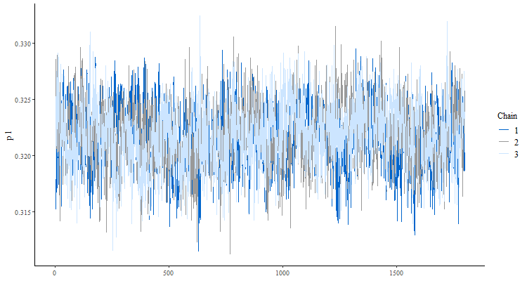

<style type="text/css">
h1.title {
  font-size: 60px;
  color: Navy;
  text-align: center;
  font-weight: bold;
}
h4.author { 
  font-size: 18px;
  #font-family: "Times New Roman", Times, serif;
  color: Black;
  text-align: left;
  font-weight: bold;
}
h4.date { 
  font-size: 18px;
  #font-family: "Times New Roman", Times, serif;
  color: Black;
  text-align: left;
  font-weight: bold;
}
</style>

```{css, echo=FALSE}
pre {
  max-height: 300px;
  overflow-y: auto;
}

pre[class] {
  max-height: 300px;
}
```


```{r setup, include=FALSE}
knitr::opts_chunk$set(echo = TRUE)
```

## <span style="color: purple;"> Useful libraries & functions</span>

In this preliminary section have been reported all the used external libraries and some useful functions used to accomplish the outbreak.

```{r include=TRUE, message=FALSE, eval=TRUE, class.source="bg-success", warning=FALSE}
library(readr)
library(readxl)
library(dplyr)
library(ggplot2)
library(ggpubr)
library(R2jags)
library(bayesplot)
library(TeachingDemos)
library(kableExtra)
library(gridExtra)
library(reshape2)
library(viridis)
library(coda)
library(corrplot)

dir.create("images", showWarnings = TRUE) # directory to images
dir.create("images/model1", showWarnings = TRUE) # directory to images
dir.create("images/model2", showWarnings = TRUE) # directory to images
```

The __fix.NA()__ function is the function used to perform a pre-processing on the acquired data. It takes in input 3 variables:

* _dataset_ = is the dataframe to be "cleaned"

* _first_ = is the column on which NAs values as to be searched and approximated

* _second_ = it is an optional variable used to infer the _first_ variable if they are correlated.
```{r include=TRUE, message=FALSE, eval=TRUE, class.source="bg-success", warning=FALSE}
fix.NA <- function(dataset,first,second=NA){
  candidate <- which(is.na(dataset[first])) # get vector of positions
  delete <- c()
  if (!is.na(second)) { # if second column is passed
    for (elm in candidate){ # iterate over all the found values
      sec <- dataset[second][elm,]
      baseline <- dataset$total_cases[elm]
      if (!is.na(sec)){ # if the second element is not NA
        new_v <- round(abs(dataset$total_cases[elm] - dataset[second][elm,]),0)
        if ((!is.na(new_v)) & (baseline >= new_v )) dataset[first][elm,] <- new_v # substitute the new value
        else delete <- c(delete, elm) # elm to be deleted 
      }
      
      else { # if it is... than compute the value using the median
        get_prov <- dataset$province[elm] # find the prov to use as groupby value
        new_v <- round(mean(c(
          dataset[first][which(dataset$province==get_prov),]
          )[[1]],na.rm=T),0) # get the median value 
        if ((!is.na(baseline)) & (dataset$total_cases[elm] >= new_v )) dataset[first][elm,] <- new_v # substitute the new value
        else delete <- c(delete, elm) # elm to be deleted
      }
    }
    print(paste('Warning: ',(length(candidate)-length(delete)),' values have been approximated & ',
                length(delete),' have been candidated...'))
    dataset <- dataset[-delete,] # candidate values

  }
  else {
    dataset <- dataset[-candidate,] # candidate values 
    print(paste('Warning: ',length(candidate),' values have been deleted...'))
  }
  return(dataset)
}
```

The __fix.NA.2()__ is another function used to perform data cleaning and infer NAs. It takes in input three parameters:

* _dataset_ = the dataset to be processed,

* _col.name_ = the column on which it is necessary to fix NA values,

* _method_ = defines the method to infer the NA values.
```{r include=TRUE, message=FALSE, eval=TRUE, class.source="bg-success", warning=FALSE}

fix.NA.2 <- function(dataset,col.name,method='median'){
  col.idx <- grep(col.name, colnames(dataset)) # get index column to use to work only on it
  elm.idx <- which(is.na(dataset[col.name])) # get element indexes where there are NAs
  for (idx in elm.idx){
    province.name <- dataset$province[idx] # get province name to use for group-by
    if (method == 'median'){
      new.value <- median(unlist(dataset[dataset$province==province.name,col.idx], use.names=FALSE),na.rm = T) #get the mean
      dataset[idx,][col.name] = new.value # update dataset with new variable
      print(paste('Warning: ',length(elm.idx),' NAs have been substituted using median...'))
    }
    else{
      new.value <- mean(unlist(dataset[dataset$province==province.name,col.idx], use.names=FALSE),na.rm = T) #get the mean
      dataset[idx,][col.name] = new.value # update dataset with new variable
      print(paste('Warning: ',length(elm.idx),' NAs have been substituted using mean...'))
      
    }
  }
  return (dataset)
}
```

The __saving()__ function is used to save the images. It takes in input 4 parameters:

* _name_ = the name of the image,

* _the.figure_ = the object to be saved,

* _w_ = is used to customize the width of the image,

* _h_ = is used to customize the height of the image. 
```{r include=TRUE, message=FALSE, eval=TRUE, class.source="bg-success", warning=FALSE}
saving <- function(name,the.figure,w,h){
  png(filename=name, width = w, height = h) # open image
  plot(the.figure)
  dev.off() # close and save image
}
```

## <span style="color: purple;"> Data Description </span>
The dataset used to perform the Bayesian Analysis comes from the combination of two files scraped on the web. In particular, the two original dataset are described as follow:

* __Ebola datatset:__ contains information about Ebola cases occurred in the Democratic Republic of Congo (DRC). The data have been collected by the reported published by DRC Ministry of Health from 22 August 2018 to 22 September 2019. The data are public available on the HUMANITARIAN DATA EXCHANGE (HDX) at the following link: [Ebola Cases and Deaths Outbreak in DRC](https://data.humdata.org/dataset/ebola-cases-and-deaths-drc-north-kivu)) 

* __Malnutrition dataset:__ contains information about the Malnutrition status in the DRC during 2018 and 2019. Also here the data have been collected by the reports released by DRC Ministry of Healt and are public available on the HUMANITARIAN DATA EXCHANGE (HDX) at the following link: [DRC Malnutrition](https://data.humdata.org/dataset/prevalence-de-la-malnutrition-en-rdc/resource/5e155c31-4e19-464d-b0bf-30914d43325f) .

```{r include=TRUE, message=FALSE, eval=TRUE, results='hide', class.source="bg-success", warning=FALSE}

## (1) IMPORT Ebola DATASET
ebola_congo <- (read_csv("dataset/ebola_congo.csv",
                    col_types = cols(`publication_date` = col_skip(), `source` = col_skip(),
                                     `report_date` = col_skip(), `country` = col_skip(),
                                     `confirmed_cases` = col_skip(),
                                     `probable_cases` = col_skip(), 
                                     `confirmed_deaths` = col_skip(),
                                     `new_deaths` = col_skip(),
                                     `total_suspected_cases` = col_skip(), 
                                     `new_cured` = col_skip(),
                                     `new_suspected_cases` = col_skip(),
                                     `old_suspected_cases` = col_skip(),
                                     `confirmed_cases_change` = col_skip(),
                                     `probable_cases_change` = col_skip(),
                                     `total_cases_change` = col_skip(),
                                     `confirmed_deaths_change` = col_skip(),
                                     `total_deaths_change` = col_skip(),
                                     `total_suspected_cases_change` = col_skip(),
                                     `province` = col_character(), 
                                     `total_cases` = col_number(), 
                                     `total_deaths` = col_number(),
                                     `total_cured` = col_number() 
                                     ))[-1,]) # -1 is used for skip the first line

ebola_congo <- fix.NA(ebola_congo,'total_deaths','total_cured')

### (1.1) grouping by health_zones
congo <- ebola_congo %>% group_by(health_zone) %>% 
  summarize(province=first(province), total_cases=sum(total_cases),
            total_deaths=sum(total_deaths), total_cured=total_cases-total_deaths) 

congo <- congo[c(-5,-7,-8,-22,-25,-27),] #delete strange health_zones 
congo <- congo[congo$total_deaths<=5000,] 

## (2) IMPORT Malnutrition DATASET
malnutrition <- read_excel("dataset/malnutrition.xlsx", 
                           col_types = c("text", "skip", "skip", 
                                         "skip", "text", "text", "numeric", 
                                         "skip", "numeric", "numeric", "numeric", 
                                         "skip", "skip", "numeric", "skip", 
                                         "skip", "skip", "skip", "skip", "numeric", 
                                         "skip", "skip", "skip", "skip", 
                                         "skip", "skip", "skip", 
                                         "skip", "skip", "skip"))

colnames(malnutrition) <- c("province", "health_zone", "postecode",
                             'population_estimate','MAS','MAM','GAM','stunted_growth',
                             'malnutrition_among_FeFAs')

malnutrition$health_zone[malnutrition$health_zone %in% c("Manguredjipa","Nyakunde") ] <- c("Mangurujipa","Nyankunde")

### (2.1) Doing intersection with the health_zones present in congo dataset too
cm_intersection <- intersect(unique(congo$health_zone), unique(malnutrition$health_zone))
malnutrition <- malnutrition[malnutrition$health_zone %in% cm_intersection,][-1]
```
The datasets contain different information about the Ebola epidemic and Malnutrition status in Congo, however not all the gathered data are useful for the analysis, for that reason some of them have been discarded. In particular the final dataset is composed by the following variables:

* __province__ = it tells us on which macro-area the data come from. There are 3 macro-areas:
  * _North Kivu_,
  * _Ituri_,
  * _South Kivu_.
<br><br>
* __health_zone__ = it gives information about the sub-area. In every macro-area there are different sup-areaS; more precisely:
  * for _North Kivu_ region there are 9 sup-areaS,
  * for _Ituri region_ there are 7 sup-areaS,
  * for _South Kivu_ region there are 1 sup-areaS.
<br>
* __total_cases__ = the number of total cases in each sub-area.

* __total_deaths__ = number of total deceases in each sub-area.

* __total_cured__ = number of recovered people.

* __postecode__ = it is the post code of every _healt_zone_

* __population_estimate__ = it is the estimate of the population in 2018-2019

* __MAM__ = it stands for "Moderate Acute Malnutrition" and it describe the degree of malnutrition in children from 6 to 59 months of age defined as _Moderate Wasting_ (i.e. weight-for-height between –3 and –2 Z-scores of the WHO Child Growth Standards median) and/or mid-upper-arm circumference (MUAC) greater or equal to 115 mm and less than 125 mm [(World Health Organization)](https://www.who.int/elena/titles/food_children_mam/en/). 

* __MAS__ = it stands for "Macrophage activation syndrome" and it is a severe, potentially life-threatening, complication of several chronic rheumatic diseases of childhood. It occurs most commonly with systemic-onset juvenile idiopathic arthritis (SoJIA) [(MAS-Wikipedia)](https://en.wikipedia.org/wiki/Macrophage_activation_syndrome).

* __GAM__ =  Global Acute Malnutrition (GAM) is a measurement of the nutritional status of a population that is often used in protracted refugee situations. Along with the Crude Mortality Rate, it is one of the basic indicators for assessing the severity of a humanitarian crisis [(GAM-Wikipedia)](https://en.wikipedia.org/wiki/Global_Acute_Malnutrition). 

* __stunted_growth__ = Stunting is the impaired growth and development that children experience from poor nutrition, repeated infection, and inadequate psychosocial stimulation. Children are defined as stunted if their height-for-age is more than two standard deviations below the WHO Child Growth Standards median [(World Health Organization)](https://www.who.int/news/item/19-11-2015-stunting-in-a-nutshell).

* __malnutrition_among_FeFAs__ = It stands for "Iron(Fe) for Adolescence" and it is a new indicator to address malnutrition among adolescents. Iron deficiency anemia is a major cause of morbidity and mortality. [(Fe-Wikipedia)](https://en.wikipedia.org/wiki/Iron-deficiency_anemia).

Summaries of the kept categorical variables are reported in Table 1.

The code below has been used to merge the two data frames: _congo_ and _malnutrition_
```{r include=TRUE, attr.output='style="max-height: 100px;"', message=FALSE, eval=TRUE, class.source="bg-success", warning=FALSE}
congo <- left_join(congo, malnutrition, by = "health_zone")

### find NAs and infer them using group median:

col.numeric<- unlist(lapply(congo, is.numeric)) # get only numeric cols
# Getting the columns of A that have at least 1 NA is equivalent to get the rows that have at least NA for t(A).
col.names <- colnames(congo[col.numeric])[!complete.cases(t(congo[col.numeric]))] # complete.cases by definition (very efficient since it is just a call to C function) gives the rows without any missing value.
for (name in col.names) congo <- fix.NA.2(congo, name) # fix NAs
```


```{r message=FALSE, echo=FALSE, class.source="bg-success", warning=FALSE}
dat <- data.frame('Var'=c('total cases','total deaths','total cured', 'MAS',
                          'MAM', 'GAM', 'stunted_growth',
                          'malnutrition_among_FeFAs','population_estimate'),
                  'Min.'=c(34,0,1, 0.30, 2.40, 2.80, 47.10, 0.20,48003),
                  'Q1.'=c(657, 241, 147, 1.90, 2.70, 4.60, 49.60, 0.20,  126776), 
                  'Median'=c(1209, 685, 631, 1.90, 2.70, 4.60, 49.60, 0.20, 161232),
                  'Mean'=c(2629,1215,1414, 2.59, 4.00, 6.64, 53.51, 0.69,200370),
                  'Q3.'=c(5562,1711,1482, 3.40, 5.10, 10.20, 55.20, 1.30,264633),
                  'Max.'=c(8889,4403,7146, 6.10, 10.90, 14.30, 72.40, 1.30,462362))
dat_summary <- dat %>% kbl(
  caption='Table 1: Categorical Variables Summary Table:') %>%
  kable_paper(bootstrap_options = "striped", full_width = F,
              html_font = "Cambria") %>%
  row_spec(0, background = alpha("orchid",.2), bold=T, color = 'black')
dat_summary
```
### <span style="color: CornflowerBlue;"> 1.1) Graphic Representation </span>

The code reported has been used to generate __Figure 1__, that shows shows a graphic representation of the 3 numerical variables: _total_cases, total_deaths and total_cured_. 
The _group.colors_ variable has been used to manually set the colors of the histograms in order to make the understanding easier. 

```{r include=TRUE, eval=FALSE, class.source="bg-success", warning=FALSE}

# (0) Set Colors
group.colors <- c('Ituri' = "royalblue3", 
                  'North Kivu' = "tomato2", 'South Kivu' ="gold1") 

# (1) DEATHS' HISTOGRAMS

## (1.1) Deaths Histogram based on "provinces"
deaths_prov <- congo %>% ggplot(aes(x=total_deaths, fill=province)) +
  geom_histogram(binwidth=500,colour = 'purple', 
                 alpha=.6,boundary = 0, closed = "right") +
  scale_fill_manual(values=group.colors) +
  ylim(0,7)+
  scale_x_discrete(name=" ",limits= seq(0,4500,500)) +
  labs(title = 'Total deaths',y=' ') +
  theme(legend.position = c(.88, 0.65),
        axis.text.y = element_text(colour='red'),
        axis.line.y = element_line(size = 1, colour = "red"),
        plot.title = element_text(hjust = 0.5, size = 14, color = 'purple'))

## (1.2) Purple Histogram
deaths_h <- congo %>% ggplot(aes(x=total_deaths)) +
  geom_histogram(binwidth=500, fill= 'orchid',colour = 'purple', 
                 alpha=.6,boundary = 0, closed = "left") +
  ylim(0,7)+
  xlim(0, 5000) +
  scale_x_discrete(name=" ",limits= seq(0,4500,500)) +
  labs(y=' ') +
  theme(axis.text.y = element_text(colour='red'),
        axis.line.y = element_line(size = 1, colour = "red"))

## (1.3) Purple Histogram + Density
deaths_d <- congo %>% ggplot(aes(x=total_deaths)) +
  geom_histogram(aes(y=..density..), binwidth=500,
                 fill= 'orchid',colour = 'purple', 
                 alpha=.6,boundary = 0, closed = "left") +
  xlim(0, 5000) +
  ylim(0,10e-04)+
  geom_density(fill='red',alpha=.2,col='violet') +
  scale_x_discrete(name=" ",limits= seq(0,4500,500)) +
  labs(y='Densities') +
  theme(plot.title = element_text(hjust = 0.5, size = 14, color = 'purple'),
        axis.title.y = element_text(size=12,colour = 'black',face='bold'),
        axis.line.y = element_line(size = 1, colour = "black"),
        axis.text.y = element_text(colour='black'))

# (2) CASES' HISTOGRAMS

## (2.1) Cases Histogram based on "provinces"
cases_prov <- congo %>% ggplot(aes(x=total_cases, fill=province)) +
  geom_histogram(binwidth=1000,colour = 'darkgreen', 
                 alpha=.6,boundary = 0, closed = "right") +
  scale_fill_manual(values=group.colors) +
  scale_x_discrete(name=" ",limits= seq(0,9000,1000)) +
  ylim(0,7)+
  labs(title = 'Total cases',y=' ') +
  theme(legend.position = c(.88, 0.65),
        axis.text.y = element_text(colour='red'),
        axis.line.y = element_line(size = 1, colour = "red"),
        plot.title = element_text(hjust = 0.5, size = 14, color = 'darkgreen'))

## (2.2) Green Histogram
cases_h <- congo %>% ggplot(aes(x=total_cases)) +
  geom_histogram(binwidth=1000, fill= 'cyan4',colour = 'darkgreen', 
                 alpha=.6,boundary = 0, closed = "left") +
  ylim(0,7)+
  scale_x_discrete(name=" ",limits= seq(0,9000,1000)) +
  labs(y=' ') +
  theme(axis.text.y = element_text(colour='red'),
        axis.line.y = element_line(size = 1, colour = "red"))

## (2.3) Green Histogram + Density
cases_d <- congo %>% ggplot(aes(x=total_cases)) +
  geom_histogram(aes(y=..density..), binwidth=1000,
                 fill= 'cyan4',colour = 'darkgreen', 
                 alpha=.6,boundary = 0, closed = "left") +
  xlim(0, 5000) +
  ylim(0,10e-04)+
  geom_density(fill='green',alpha=.2,col='seagreen1') +
  scale_x_discrete(name=" ",limits= seq(0,9000,1000)) +
  labs(y=' ') +
  theme(plot.title = element_text(hjust = 0.5, size = 14, color = 'darkgreen'),
        axis.line.y = element_line(size = 1, colour = "black"),
        axis.text.y = element_text(colour='black'))
```

Encapsulate the 6 plots into one figure object and save it.
```{r message=FALSE, include=TRUE, eval=FALSE, class.source="bg-success", warning=FALSE}
figure <- ggarrange(deaths_prov, cases_prov,
                    deaths_h, cases_h,
                    deaths_d, cases_d,
                    ncol = 2, nrow = 3, align = 'hv')

annotaded_fi <- annotate_figure(figure,
                bottom = text_grob("Data source: \n https://data.humdata.org/dataset/ebola-cases-and-deaths-drc-north-kivu",
                                   color = "blue", hjust = 1.01, x = 1,
                                   face = "italic", size = 10),
                left = text_grob("Frequencies", color = "red", size=12,
                                 rot = 90, face='bold', hjust = -.4,
                                 vjust = 2.3),
                fig.lab = " ", fig.lab.face = "bold")

annotaded_fi
saving('images/death_cases_histogram.jpg',annotaded_fi,w=900,h=556)
```

 

## <span style="color: purple;"> 1)  Model 1 </span>

In this first model independence among each death probabilities has been assumed among each sub-area. In order to model the outcome, a Binomial distribution has been used. The total number of infected people per each sub area $i$ as been denoted with $n_{i}$. The total number of deceased people is represented by $r_{i}$ which is a binary response variable with "true" probability $p_{i}$. 

\[r_i \sim Binomial(p_i,n_i) \] 

A Beta(1,1) distribution as been used as standard-non-informative prior for $p_{i}$. The Beta distribution is a continuous distribution taking values in the domain 0-1.

\[p_i \sim Beta(1 ,1) \] 

In order to make inference on the $p_{i}$ the model has been written in order to be compatible for JAGS (Just Another Gibbs Sampler).

### <span style="color: CornflowerBlue;"> 1.1) JAGS Model 1 </span>

Since JAGS does not deal with dataframes it is necessary to store all the required variables into lists.

```{r message=FALSE, include=TRUE, eval=TRUE, class.source="bg-success", warning=FALSE}
n <- congo$total_cases # tries 
r <- congo$total_deaths # number of success (unfortunately...)
N <- nrow(congo)
congo.jags <- list("r", "n", "N")
```


```{r message=FALSE, include=TRUE, eval=TRUE, class.source="bg-success", warning=FALSE}
# Model
model <- function() {
  for(i in 1:N){
    r[i] ~ dbinom(p, n[i]) # Model
  }
  p ~ dbeta(1.0, 1.0) # Prior
}

# Starting values
mod.inits = function(){
  list("p" = rbeta(1, 1/2, 1/2))
}

# Run JAGS
set.seed(1618216)
mod.fit <- jags(data = congo.jags,                            
                model.file = model, inits = mod.inits,          
                parameters.to.save = c("p"),                  
                n.chains = 3, n.iter = 10000, n.burnin = 1000, n.thin=5)
```


### <span style="color: CornflowerBlue;"> 1.2) Output & Convergence Diagnostic </span> {#Out1.2}

```{r message=FALSE, include=TRUE, eval=TRUE, class.source="bg-success", warning=FALSE}
mod.fit
```

One way to check if the MCMC performed on JAGS can be trusted it is to look at the chains and see if they are stationary (i.e if the simulated parameters are going in a consistent direction). In order to do that, it is necessary to extract the data from model outputs (this can be performed by going inside the __JAGS output__ and retrieve the __sims.array__ ) and then use different plot representation to inspect sampling behavior and assess convergence.

```{r message=FALSE, include=TRUE, eval=TRUE, class.source="bg-success", warning=FALSE}
chainArray <- mod.fit$BUGSoutput$sims.array # get the chain
```

#### <span style="color: turquoise;"> 1.2.1) TracePlot & Gelman-Rubin </span>

A useful diagnostic plot is the trace plot, which actually is a time series plot of the Markov chains. In the trace plot is possible to see the evolution of the parameter vector over the iterations of one or many Markov chains.
If a chain is stationary, it should showing any long-term trends, meaning that the average value of the chain should be almost flat. Therefore, by looking at the __Figure 2__, it seems so. This means that if we try, for example, to estimate $p$ by using the first 500 iterations we are going to get
a similar result that we would get if we try to estimate the $p$ by using, for example, iterations from 1000 to 1500. Moreover, it also seems that all the chains explore the same region of parameter values and this can be infer by the fact that all the chains lie on top of each other. 

```{r message=FALSE, include=TRUE, eval=TRUE, class.source="bg-success", warning=FALSE, fig.cap = "Figure 2: Trace Plot"}

# this is variable is used to change the aspect of some plots.
myfacets <-
  facet_bg(fill = "gray30", color = NA, ) +
  facet_text(face = "bold", color = "skyblue", size = 10) 

# (1) mcmc_trace
color_scheme_set("mix-brightblue-gray")
## (1.1) plot first 4 p_{i}
mcmc_trace(chainArray, facet_args = list(labeller = ggplot2::label_parsed)) +
  myfacets

```

However, since the plot is still too confused, it could help our diagnostic to have a closer look at it by using the _"window"_ parameter inside the _"mcmc_trace function"_ and see how every chain behaves. 
As __Figure 3__ shows, it seems that the chains spend substantial time in the same region of the parameter space, sign that they are reaching stationarity.

```{r message=FALSE, include=TRUE, eval=TRUE, class.source="bg-success", warning=FALSE, fig.cap = "Figure 3: Trace Plot"}
mcmc_trace(chainArray, pars = "p", window = c(300,500),
           facet_args = list(labeller = ggplot2::label_parsed))+
  myfacets
```

Since __Trace PLots__ provide an informal diagnostic about the 
convergence of the chains, we coul relay on a better diagnostic called
__Gelman & Rubin diagnostic__. This diagnostic calculates the variability
within/inside the chains and compares that to the variability between the
chains [(Gelman & Rubin)](https://blog.stata.com/2016/05/26/gelman-rubin-convergence-diagnostic-using-multiple-chains/).
We can actually compute this diagnostic by calling the __gelman.diag()__ funciton
implemented in __coda library__. The __Potential Scale Factor__ is the 
statistics that tells us about the chain convergence should be close to 1.
Values farway from 1 indicates that the chains haven't reached yet convergence.

```{r message=FALSE, include=TRUE, eval=TRUE, class.source="bg-success", warning=FALSE}
coda.fit <- as.mcmc(mod.fit)
gelman.diag(coda.fit)
```
As we can see, the chains reached convergence since this value is 1.
We can also plot this diagnostic by using the __gelman.plot()__ function.
It shows how the "_shrinkage_ factor" changes once we add iterations to the chains. As we can see, after $6000$ we are almost sure to have reached convergence.


```{r message=FALSE, include=TRUE, eval=TRUE, class.source="bg-success", warning=FALSE, fig.cap = "Figure 4: Gelman-Rubin Plot"}
coda.fit <- as.mcmc(mod.fit)
gelman.plot(coda.fit)
```

#### <span style="color: turquoise;"> 1.2.2) Autocorrelation </span>

Another relevant diagnostic analysis can be done by checking the autocorrelation plots.Autocorrelation is number between -1 and 1 and it measures how "_linearly_ dependent" the current value of the chains are to past values (== Lags). See [Appendix A](#A) for autocorrelation explanation.

For example the $0^{th}$ lag as a perfect Autocorrelation with itself (==1).
Instead, with the $1_{st}$ lag it has a value of around 0.5 or slightly more. And, as we go further and further, the values become less correlated. We can also take a look at the values of the autocorrelation values them selves by using the __autocorr.diag()__ function in __coda__. What we expect is that the autocorrelation does not persist for longer once we move forward in the iterations. 

```{r message=FALSE, include=TRUE, eval=TRUE, class.source="bg-success", warning=FALSE}
autocorr.diag(coda.fit)
```

In fact, by calling the previous function we see that at the $5_{th}$ lag the autocorrelation for $p$ already goes to zero.
Autocorrelation is very important because it tells us how much information is available in each Markov chain. Sampling $1e4$ iteration from a highly correlated Markov chain yields less information about the stationary distribution than we would obtain from $1e4$ independently drawn from the stationary distribution.

Autocorrelation is very important when we go to calculate the __effective sample size__ in the chain. The Monte Carlo __effective sample size__ tells us how many independent samples from the stationary distribution you should drawn in order to get the same information from our MCMC. I.e. it is the 
sample size that we have kept from the Monte Carlo. __Figure 4__ shows the autocorrelation for all the three chains. As can be seen from the figures, the autocorrelation drops pretty fast to zero (after only few lags, 2-3) meaning that there is not autocorrelation among different values in the chains. This is
possible since JAGS already drops-auto autocorrelated samples by performing jumps. In fact, the effective sample size for $p$ is not $1e4$ but lower. But how much lower? in the __coda package__ there is the function called __effectiveSize()__ which tells us the effective sample size. In this case, for $p$ is of $5400$. Is this number big enough to create reliable 95% posterior intervals ? In order to now that we can relay on the __Raftery and Lewis diagnostic__  (also implemented in the __coda package__) that tells us how many iterations in our chain we need in order to be 95% confident that we are estimating the $0.025$ quantile  of the distribution to an accuracy of $0.005$. In this case we need $4022$ so, we are good enough.

It is possible to visualize the autocorrelation by calling the __mcmc_acf__ function. This function shows the autocorrelation for each Markov chain separately up to a user-defined number of lags. What is expected is to see a low autocorrelation since it is a signal of convergence. As it possible to see from the __Figure 5__, the autocorrelation function drops to 0 pretty fast after only a couple of lags.

```{r message=FALSE, include=TRUE, eval=TRUE, class.source="bg-success", warning=FALSE, fig.cap = "Figure 5: Autocorelation Plots"}
# (2) mcmc_acf
color_scheme_set("mix-teal-pink") # set color
## (2.1) plot first 4 p_{i}
mcmc_acf(chainArray, facet_args = list(labeller = ggplot2::label_parsed))+
  myfacets

```

#### <span style="color: turquoise;"> 1.2.3) Posterior Distributions </span>

Another diagnostic  analysis can be done by taking a look at the plots of estimated density of the parameters and of the deviance, where density plots are just smoothed histograms of the samples. These are shown in __Figure 6__ reported here below.

```{r message=FALSE, include=TRUE, eval=TRUE, class.source="bg-success", warning=FALSE, fig.cap = "Figure 6: Density Overlay Plot"}
# (3) mcmc_density
color_scheme_set("pink")
## (3.1) plot first 4 p_{i}
myfacets <-
  facet_bg(fill = "gray50", color = NA, ) +
  facet_text(face = "bold", color = 'white', size = 10)

mcmc_dens_overlay(chainArray, facet_args = list(labeller = ggplot2::label_parsed)) +
  myfacets

```

```{r message=FALSE, include=TRUE, eval=TRUE, class.source="bg-success", warning=FALSE, fig.cap = "Figure 7: Posterior Density Plot"}
# (4) areas plot
color_scheme_set("green")
plot_title <- ggtitle("Posterior distributions",
                      "with Median & 90% Intervals")
chain_p <- mcmc_areas(chainArray, pars="p", prob = 0.9, point_est = 'median') + plot_title

chain_dev <- mcmc_areas(chainArray,
           pars=c("deviance"),
           prob = 0.9, point_est = 'median') + plot_title

ggarrange(chain_p, chain_dev,
          ncol = 2, nrow = 1)
```


### <span style="color: CornflowerBlue;"> 1.3) Inferential finding Model 1 </span>

Let's compute the point estimate for the $p$

```{r message=FALSE, include=TRUE, eval=TRUE, class.source="bg-success", warning=FALSE}
chainMat <- mod.fit$BUGSoutput$sims.matrix # join the deviance and pi for all the 3 chains

p.hat.jags <- colMeans(chainMat)
p.hat.jags
```

Now these results can be used to compute _Interval Estimation_, both equal tails and HPD (Highest Posterior Density region)

__Equal Tail Intervals & HPD Intervals: __
```{r message=FALSE, include=TRUE, eval=TRUE, class.source="bg-success", warning=FALSE}
cred <- 0.95
p.ET.jags <- apply(chainMat, 2, quantile, prob=c((1-cred)/2, 1-(1-cred)/2))

p.HPD.jags <- HPDinterval(as.mcmc(chainMat))

```

```{r message=FALSE, include=TRUE, eval=TRUE, class.source="bg-success", warning=FALSE}

res.dat <- round(data.frame('ET2.5'=p.ET.jags[1,],
                      'ET97.5'=p.ET.jags[2,],
                      'HPD2.5'=p.HPD.jags[,1],
                      'HPD97.5'=p.HPD.jags[,2]),4)
row.names(res.dat)[2] <- "$p$"

my.colors <- c('white',rep('royalblue',2),rep('yellow',2)) # set colors

kbl(res.dat,col.names = NULL,
    caption="     95% Intervals:") %>%
  kable_styling(bootstrap_options = c("striped", "hover", "condensed", "responsive")) %>%
  add_header_above(c(" ", "Lower" = 1, "Upper" = 1, "Lower" = 1, "Upper" = 1),
                   bold = T, background = alpha(my.colors, 0.05), color = 'red') %>%
  add_header_above(c(" ", "Equal Tail" = 2, "HPD" = 2),
                   background = alpha(my.colors[c(1:2,4)],0.05), color = 'black') %>%
  column_spec(c(2,3), background = alpha(my.colors[2], 0.05)) %>%
  column_spec(c(4,5), background = alpha(my.colors[4], 0.05)) 

```

## <span style="color: purple;"> 2)  Model 2 </span>

In Model 1 it has been assumed that the true death probabilities are independent for each sub-area however, this is actually not too realistic. In fact, it is better to assume dependence among them and that they could be similar in some ways. For that reason a more realist _Statistical Model_ has been implemented to describe present behavior and/or predict future performances. The model is composed by three components: the well known response variable $Y_{i}$ (the probability of death), the explanatory variables $X_{i}$ and a link function used to connect the stochastic part ($X_{i}$ variable) and the deterministic part ($X_{i}$) of the model. In this specific scenario a Generalized Linear Model (GLM), which is an extension of the Normal Linear Regression Model based on exponential family distributions. Since it has been used a Binomial distribution this model is hence suitable for this kind of analysis.

In order to understand which variables can actually better explain the variability of the dependent variable the Pearson Correlation Coefficient has been computed among all the Numerical variables and the results are returned by __Figure 8__:

```{r message=FALSE, include=TRUE, eval=TRUE, class.source="bg-success", warning=FALSE, fig.cap = "Figure 8: Heatmap"}

# (1) Code to plot HEATMAP

Cor = cor(congo[unlist(lapply(congo, is.numeric))])
#change col and row names just for readability 
v.names <- c('tot.cases','tot.deaths','tot.cured','pop','MAS','MAM','GAM','STG','FeFA')
colnames(Cor) <- v.names
rownames(Cor) <- v.names
corrplot(Cor, type="upper", method="ellipse", tl.pos="d")
corrplot(Cor, type="lower", method="number", col="black", 
         add=TRUE, diag=FALSE, tl.pos="n", cl.pos="n")
```
<br><br>

As it is possible to see from figure above, three variables seems to be more influent in explaining the variance of the dependent variable: __"GAM", "stunned_growth" and "malnutrition_among_FeFAs"__. However, once could ask why neither __MAM__ nor __MAS__ have been included in the model since they are both highly negatively correlated with __total_deaths__. This is due to the fact that they actually are strongly correlated with the __GAM__ variable (respectively 0.84 and 0.88) meaning that, these features, combined together do not add significantly information regarding the dependent variable but they 
actually only contribute to make the model more complex. For that reason only __GAM__ has been included since it has a stronger correlation with the dependent variable compared to the other two.

Hence, the structure of the model is:

\begin{aligned}
 r_{i} &\sim Binomial(p_{i},n_{i})\label{eq:1} \\
 \log(p_i/(1-p_i) &= \beta_{0} + \sum^{3}_{j=1}\beta_{j}x_{ij} = \beta_{0} +
 \beta_{1}GAM_{i} + \beta_{2}STG_{i} + \beta_{3}pop_{i},\\
 &for \;\; i = 1,2,...,n\label{eq:2}\\
 \\
 \beta_{i} &\sim Normal(\mu,\tau)
\end{aligned}

__or in odds notation:__

\begin{aligned}
r_i &\sim Binomial(\frac{odds_{i}}{1+odds_{i}},n_i) \\

odds_{i} &= \frac{p_{i}}{1-p_{i}} \\

\log(odds_{i}) &= \beta_{0} + \beta_{1}GAM_{i} + \beta_{2}STG_{i} + \beta_{3}pop_{i}
\end{aligned}

Standard-non-informative priors are specified both for population mean (logit) probability of death ($\mu$) and precision($\tau$).

\begin{aligned}
\mu &\sim Normal(0, 10^{-6})\\

\frac{1}{\tau^{2}} &\sim Gamma(10^{-3}, 10^{-3})
\end{aligned}

### <span style="color: CornflowerBlue;"> 2.1) JAGS Model 2 </span>


```{r message=FALSE, include=TRUE, eval=TRUE, class.source="bg-success", warning=FALSE}
n <- congo$total_cases # tries 
r <- congo$total_deaths # number of success (unfortunately...)
GAM <- congo$GAM
STG <- congo$stunted_growth
FeFA <- congo$malnutrition_among_FeFAs
N <- nrow(congo)

congo.jags2 <- list("r", "n", "N","GAM","STG","FeFA")
model2 <- function() {
  
  # (1) Likelihood
  for(i in 1:N){
    r[i] ~ dbinom(p[i], n[i]) #Model
    logit(p[i]) <- beta[1] + beta[2]*GAM[i] + beta[3]*STG[i] + beta[4]*FeFA[i] #link
  }
  
  # (2) Priors
  # betas start from 1 and not from 0 to be in concordance with JAGS notation
  for (j in 1:4){ beta[j]~dnorm( mu, tau) }  # pooling

  mu ~ dnorm(0.0, 1e-6) # vague mean Prior -->  there is e-06 since in JAGS it is necessary to pass the PRECISION (which is the inverse of the sd). Lower the Precision higher the SD
  tau ~ dgamma(0.001, 0.001) # vague tau (Precision)
  
  sigma <- 1 / sqrt(tau) # we return the sd that is the inverse squared of the Precision (tau)
  pop.mean <- exp(mu) / (1 + exp(mu))
}

# Starting values
mod.inits2 = function(){
  list(tau = 1e3,
       mu = 0)
}

# Run JAGS
set.seed(1618216)
mod.fit2 <- jags(data = congo.jags2,                            
                 model.file = model2, inits = mod.inits2,          
                 parameters.to.save = c("p","sigma","mu","pop.mean", "beta"),         
                 n.chains = 3, n.iter = 1e4, n.burnin = 1000, n.thin=5)

```

### <span style="color: CornflowerBlue;"> 2.2) Output & Convergence Diagnostic </span>

```{r message=FALSE, include=TRUE, eval=TRUE, class.source="bg-success", warning=FALSE}
mod.fit2
```

As it is possible seen from the output table returned by JAGS, the estimated death probabilities per each Area quite high. But where are they come from? Since it has been used a Binomial with a prob of success $p_{i}$ and the logit of each $p_{i}$ has been modeled as a linear model, this leads to an exponential form equal to:

\begin{aligned}
  E(y_{i}) &= p_{i} = \frac{e^{\beta_{0} + \sum^{3}_{j=1}\beta_{j}x_{ij}}}{1 +
  e^{\beta_{0} + \sum^{3}_{j=1}\beta_{j}x_{ij}} }
\end{aligned}

Now, if we invert the _link function_ by dividing the numerator and the denominator by the numerator we get better better expression for the $y_{i}$:

\begin{aligned}
  E(y_{i}) &= \frac{1}{1 + e^{-(\beta_{0} + \sum^{3}_{j=1}\beta_{j}x_{ij)}} } \\
  
  E(y_{i}) &= \frac{1}{1 + e^{-(-5.568 + 0.121 \times GAM_{i} + 0.085 \times STG_{i} + 0.292 \times FeFA_{i})} }
\end{aligned}

Now, if someone substitute each x_{i} with the original values and multiply them by the \beta_{s} coefficinets, the results will be the already seen estimated probabilities of death for each region. This is shown by the table reported below:

```{r message=FALSE, include=TRUE, eval=TRUE, class.source="bg-success", warning=FALSE}

chainMatrix2 <- mod.fit2$BUGSoutput$sims.matrix # extraxt chains
pm_coeff <- colMeans(chainMatrix2) #posterior mean of the coefficients betas

exp_comp <- function(x1,x2,x3) 1/(1+exp(-(-5.56819741+0.12126469*x1+0.08479912*x2+0.29248419*x3)))
est.probs <- rep(1,N)
for (n in 1:nrow(congo)) est.probs[n] <- exp_comp(congo$GAM[n],congo$stunted_growth[n],congo$malnutrition_among_FeFAs[n])

X = round(cbind('est.probs'=est.probs, 'JAGS.probs' = pm_coeff[7:23]),4)
X <- data.frame(X)
X <- data.frame(t(X))
colnames(X) <- paste("$p_{",seq(1:17),"}$",sep='')

X %>% kbl() %>%
  kable_styling(bootstrap_options = c("striped", "hover", "condensed", "responsive"),full_width = F) %>%
  row_spec(0, background = alpha("orchid",0.2), color = 'black') %>%
  column_spec(1, bold=TRUE) %>%
  scroll_box(width = "830px") 

```

#### <span style="color: turquoise;"> 2.2.1) TracePlot & Gelman-Rubin </span>

As it has been done in [Diagnostic for Model 1](#Out1.2), in order to check if the chains has reached the stationary, different diagnostics also here have been performed.
Also here it is required to extrapolate the __sims.array__ from the __JAGS Output__ in order to move on.

```{r message=FALSE, include=TRUE, eval=TRUE, class.source="bg-success", warning=FALSE}
chainArray2 <- mod.fit2$BUGSoutput$sims.array # get the chain
```

As first, it is always a good starting point to have a look at the __Trace Plots__. It is important to remember that, with this analysis it is possible to see the evolution of the parameter vector over the iterations of the Markov Chains. As shown in __Figure 9__, all the chains, referring to the \betas coefficients, seem to be exploring the same region of parameter values and this can be infer by the fact that all the chains lie on top of each other. So, it seems that all the chains has reached stationary.

```{r message=FALSE, include=TRUE, eval=TRUE, class.source="bg-success", warning=FALSE, fig.cap = "Figure 9: Trace Plot"}
# this is variable is used to change the aspect of some plots.
myfacets <-
  facet_bg(fill = "gray30", color = NA, ) +
  facet_text(face = "bold", color = "skyblue", size = 10)

# (1) mcmc_trace
color_scheme_set("mix-brightblue-gray")
## (1.1) plot first 4 p_{i}
mcmc_trace(chainArray2,par=c("beta[1]","beta[2]","beta[3]","beta[4]"),
         facet_args = list(labeller = ggplot2::label_parsed)) +
  myfacets

```
It is also possible to take a look at the __Trace Plots__ for the estimated probabilities $p_{i}$ thanks to the __FIgure 10__:



Also here, since the plot is too confused, it could help our diagnostic to have a closer look at it by using the “window” parameter inside the “mcmc_trace function” and see how every chain behaves.
As __Figure 10__ shows, it seems that the chains spend substantial time in the same region of the parameter space, sign that they are reaching stationary.


```{r message=FALSE, include=TRUE, eval=TRUE, class.source="bg-success", warning=FALSE, fig.cap = "Figure 11: Beta Window Trace Plot"}
mcmc_trace(chainArray2, pars = "beta[2]", window = c(300,500),
           facet_args = list(labeller = ggplot2::label_parsed))+
  myfacets
```


Since Trace PLots provide an informal diagnostic about the convergence of the chains, we coul relay on a better diagnostic called __Gelman & Rubin diagnostic__. This diagnostic calculates the variability within/inside the chains and compares that to the variability between the chains (Gelman & Rubin). We can actually compute this diagnostic by calling the gelman.diag() funciton implemented in coda library. The Potential Scale Factor is the statistics that tells us about the chain convergence should be close to 1. Values farway from 1 indicates that the chains haven’t reached yet convergence.

```{r message=FALSE, include=TRUE, eval=TRUE, class.source="bg-success", warning=FALSE}
coda.fit2 <- as.mcmc(mod.fit2)
gelman.diag(coda.fit2[,c(1:4)])
```

As we can see, the chains reached convergence since this value is 1. We can also plot this diagnostic by using the __gelman.plot()__ function. It shows how the _“shrinkage factor”_ changes once we add iterations to the chains.
As we can see, after $6000$ we are almost sure to have reached convergence.

```{r message=FALSE, include=TRUE, eval=TRUE, class.source="bg-success", warning=FALSE, fig.cap = "Figure 12: Gelman-Rubin Plot"}
coda.fit2 <- as.mcmc(mod.fit2)
gelman.plot(coda.fit2[,c(1:4)])
```

It is also possible to take a look at the __Gelman-Rubin Plot__ for the estimated probabilities $p_{i}$ by __FIgure 13__. As can be seen from the animated image, not all the estimated probabilities reached the convergence after $6000$. Some of them required more time.


#### <span style="color: turquoise;"> 2.2.2) Autocorrelation </span>

We cannot only rely on the stationary, we need also here to check autocorrelation. In order to take a look at the the values of the autocorrelation values them selves by using the __autocorr.diag()__ function in coda. What we expect is that the autocorrelation does not persist for longer once we move forward in the iterations. As it possible to see from the numeric values in the panel below and from __Figure 12__, the autocorrelation for  the coefficients $\beta_{s}$ and estimated $p_{i}$ probabilities doesn't drop very fast, but it takes some more Lags if compared to the previous model. 

```{r message=FALSE, include=TRUE, eval=TRUE, class.source="bg-success", warning=FALSE, fig.cap = "Figure 11: Trace Plot"}
aut.dat <- round(data.frame(autocorr.diag(coda.fit2)),4)
colnames(aut.dat)[c(1:4,25)] <- c("$\\beta_{1}$","$\\beta_{2}$","$\\beta_{3}$","$\\beta_{4}$","$\\sigma$")
colnames(aut.dat)[c(7:23)] <- paste("$p_{",seq(1:17),"}$",sep='')

aut.dat[,c(1:5,7:23,25,24,6)] %>% kbl(caption='Autoccorelation Diagnostic:') %>%
  kable_styling(bootstrap_options = c("striped", "hover", "condensed", "responsive"),full_width = F) %>%
  row_spec(0, background = alpha("orchid",0.2), color = 'black') %>%
  column_spec(1, bold=T,width = "80px") %>%
  scroll_box(width = "830px")
```

As it has been pointed out in the previous section, Autocorrelation is very import since it assesses how much information is available in each Markov chain. Sampling _1e4_ iterations from a highly correlated Markov Chain yields less information about the stationary distribution than _1e4_ independently draws from the stationary distribution. For that reason, it plays a key rule in calculating the effective sample size in each chain. The __Monte Carlo Effective Sample Size__ tells us how many independent samples from the stationary distribution you should drawn in order to get the same information from our MCMC. 

However, as said in [Diagnostic Model 1 Section](#Out1.2), autocorrelation alone is not enough and needs to be supported by the __Rafery and Lewis diagnostic__ that tells at least how much lower the __Effective Sample Size__ should be in order to build up reliable 95% posterior intervals. These numbers are displayed in the panel below:


VEDI MODEL 1 PER Raftery and Lewis diagnostic !!!!!!!!!!!!!!!

It is possible to visualize the autocorrelation by calling the __mcmc_acf()__ function. This function shows the autocorrelation for each Markov chain separately up to a user-defined number of lags. What is expected is to see a low autocorrelation since it is a signal of convergence.


```{r message=FALSE, include=TRUE, eval=TRUE, class.source="bg-success", warning=FALSE, fig.cap = "Figure 12: Trace Plot"}
# (2) mcmc_acf
color_scheme_set("mix-teal-pink") # set color
## (2.1) plot first 4 p_{i}
mcmc_acf(chainArray2,par=c("beta[1]","beta[2]","beta[3]","beta[4]"),
         facet_args = list(labeller = ggplot2::label_parsed))+
  myfacets

```


#### <span style="color: turquoise;"> 2.2.3) Posterior Distributions </span>

Now, it is reasonable to have a look at the plots of estimated density of the coefficients and estimated probabilities. These are shown in __Figure 13__ reported here below.

SCRIVI QUALCOSA SU RELIABILITY OF BETAS!!!!!!!!!!!!!!!!!

```{r message=FALSE, include=TRUE, eval=TRUE, class.source="bg-success", warning=FALSE, fig.cap = "Figure 13: Density Overlay Plot for Betas"}
# (3) mcmc_density
color_scheme_set("pink")
## (3.1) plot first 4 p_{i}
myfacets <-
  facet_bg(fill = "gray50", color = NA, ) +
  facet_text(face = "bold", color = 'white', size = 10)

mcmc_dens_overlay(chainArray2,par=c("beta[1]","beta[2]","beta[3]","beta[4]"),
           facet_args = list(labeller = ggplot2::label_parsed)) +
  myfacets

```

```{r message=FALSE, include=TRUE, eval=TRUE, class.source="bg-success", warning=FALSE, fig.cap = "Figure 14: Density Overlay Plot for Deviance and Sigma"}
# (3) mcmc_density
color_scheme_set("pink")
## (3.1) plot first 4 p_{i}
myfacets <-
  facet_bg(fill = "gray50", color = NA, ) +
  facet_text(face = "bold", color = 'white', size = 10)

mcmc_dens_overlay(chainArray2,par=c("deviance","sigma"),
           facet_args = list(labeller = ggplot2::label_parsed)) +
  myfacets

```

Instead, in the animated figure below it is possible to see the __Density plots__ for the estimated probabilities $p_{i}$:


```{r message=FALSE, include=TRUE, eval=TRUE, class.source="bg-success", warning=FALSE, fig.cap = "Figure 16: Posterior Density Plots with Medians and Intervals"}
# (4) areas plot
# (4.1) areas plot
color_scheme_set("green")
b1 <- mcmc_areas(chainArray2,
           pars=c("beta[1]"),
           prob = 0.9, point_est = 'median')
b2 <- mcmc_areas(chainArray2,
           pars=c("beta[2]"),
           prob = 0.9, point_est = 'median')
b3 <- mcmc_areas(chainArray2,
           pars=c("beta[3]"),
           prob = 0.9, point_est = 'median')
b4 <- mcmc_areas(chainArray2,
           pars=c("beta[4]"),
           prob = 0.9, point_est = 'median') 
dev <- mcmc_areas(chainArray2,
           pars=c("deviance"),
           prob = 0.9, point_est = 'median') 
sig <- mcmc_areas(chainArray2,
           pars=c("sigma"),
           prob = 0.9, point_est = 'median') 
fig <- ggarrange(b1, b2,
          b3, b4,
          dev, sig,
          ncol = 3, nrow = 2)
annotate_figure(fig, top = text_grob(
  "Posterior distributions with Medians & 90% Intervals", 
  color = "black",hjust = 1.01, x = 1,
  face = "italic", size = 18))

```


### <span style="color: CornflowerBlue;"> 2.3) Inferential finding Model 2 </span>

Let's compute the point estimate for the $p$

```{r message=FALSE, include=TRUE, eval=TRUE, class.source="bg-success", warning=FALSE}
chainMatrix2 <- mod.fit2$BUGSoutput$sims.matrix # join the deviance and pi for all the 3 chains

p.hat.jags2 <- colMeans(chainMatrix2)
p.hat.jags2
```

Now these results can be used to compute _Interval Estimation_, both equal tails and HPD (Highest Posterior Density region)

__Equal Tail & HPD Intervals: __
```{r message=FALSE, include=TRUE, eval=TRUE, class.source="bg-success", warning=FALSE}
cred <- 0.95
p.ET.jags2 <- apply(chainMatrix2, 2, quantile, prob=c((1-cred)/2, 1-(1-cred)/2))
p.HPD.jags2 <- HPDinterval(as.mcmc(chainMatrix2))
```


```{r message=FALSE, include=TRUE, eval=TRUE, class.source="bg-success", warning=FALSE}
res.dat2 <- data.frame('ET2.5'=p.ET.jags2[1,],
                      'ET97.5'=p.ET.jags2[2,],
                      'HPD2.5'=p.HPD.jags2[,1],
                      'HPD97.5'=p.HPD.jags2[,2])

row.names(res.dat2)[c(1:4,25)] <- c("$\\beta_{1}$","$\\beta_{2}$","$\\beta_{3}$","$\\beta_{4}$","$\\sigma$")
row.names(res.dat2)[c(7:23)] <- paste("$p_{",seq(1:17),"}$",sep='')


my.colors <- c('white',rep('royalblue',2),rep('yellow',2)) # set colors

kbl(round(res.dat2[c(1:5,7:23,25,24,6),],4),col.names = NULL,
    caption="     95% Intervals:") %>%
  kable_styling(bootstrap_options = c("striped", "hover", "condensed", "responsive")) %>%
  add_header_above(c(" ", "Lower" = 1, "Upper" = 1, "Lower" = 1, "Upper" = 1),
                   bold = T, background = alpha(my.colors, 0.05), color = 'red') %>%
  add_header_above(c(" ", "Equal Tail" = 2, "HPD" = 2),
                   background = alpha(my.colors[c(1:2,4)],0.05), color = 'black') %>%
  column_spec(c(2,3), background = alpha(my.colors[2], 0.05)) %>%
  column_spec(c(4,5), background = alpha(my.colors[4], 0.05)) %>%
  scroll_box(height = "400px")
```


## <span style="color: purple;"> Model Comparison </span>


In order to compare models it is possible to use the DIC (Deviance Information Criterion) metric. DIC is a Bayesian method for model comparison and a measure for the prediction error of a model. The lower DIC value the better the model fits the data. 

The deviance D, given a parameter value $\theta$ returns error using the log-likelihood function:
$D(\theta) = -2  \text{log} * L(data|\theta)$

Once the posterior means are computed, it is possible to measure the deviance as:

$D(\hat{\theta}) = -2 \text{log} * L(data|\hat{\theta})$
Taking all steps i in the different MCMCs, it is possible to compute an average - posterior mean of the deviance as follows:

$\hat{D} = \frac{1}{M}\sum^{M}_{i=1}D (\theta_{i})$

Now it is possible to compute the effective number of parameters:

$p_{D} = \hat{D} - D(\hat{\theta})$

The DIC is then computed:

$DIC = D(\hat{\theta})- 2 p_{D}$

```{r message=FALSE, include=TRUE, eval=TRUE, class.source="bg-success", warning=FALSE, results = 'asis'}

cat(
  paste("- `", "Model 1 DIC: ",round(mod.fit$BUGSoutput$DIC, 3), "`"),
  paste("- `", "Model 2 DIC: ",round(mod.fit2$BUGSoutput$DIC, 3), "`"),
  sep='\n'
)

```
<br><br>

Looking at the DIC values, it is clearly shown that there is a significant difference among them. And in fact the difference is equal to:

```{r message=FALSE, include=TRUE, eval=TRUE, class.source="bg-success", warning=FALSE, results = 'asis'}
cat(paste("`", "DIC Difference:", round(abs(mod.fit$BUGSoutput$DIC - mod.fit2$BUGSoutput$DIC),3),"`"))
```
<br><br><br><br>


## <span style="color: green;"> Appendix A</span> {#A}


\[ ACF(X_{t},X_{t-l}) = \frac{Cov(X_{t},X_{t-l})}{\sqrt{Var(X_{t}) \times Var(X_{t-l})}}
\]

If the sequence is stationary (as it is), the joint distribution of multiple Xs doesn't change with time shifts, then autocorrelation for two variables doesn't depend on the exact times $t$ and $t-l$ but rather on the distance between them: $l$. This is the reason why the autocorrelation plots are computed in terms of lags. Font: [Autocorrelation](https://d3c33hcgiwev3.cloudfront.net/_dd6d312e631a80339ba1627e1d72b42d_Autocorrelation.pdf?Expires=1617580800&Signature=C0iakoYnGzE7BJ41iur6mM88n5Ep-68RT4-FwiSl01~-NtdzvDKw~qGYDMH~57PeVjb69IxHYwXbAg0JM5i8UGSaIl~euKpQuWpLPqKWm6f-2c4E03xZTqy3kUzuJTAtaBj0VvR59MAt2HZdXCK5kv8Xyy~LonopjZq2f1KGKUQ_&Key-Pair-Id=APKAJLTNE6QMUY6HBC5A)


